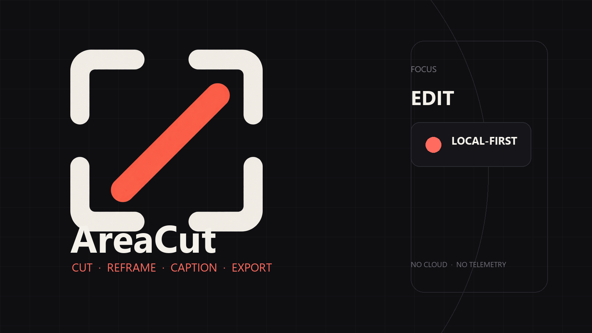

<p align="center">
  <br>
  <strong>AreaCut</strong>
</p>

<p align="center">
  <em>Cut. Reframe. Caption. Export.</em>
</p>

<p align="center">
  
</p>

<p align="center">
  
  
  
  
  
</p>

**AreaCut** is a minimal, local-first video editor for Windows, built for social content. It turns desktop recordings and videos into Instagram Reels, TikToks, YouTube Shorts and standard landscape video — entirely on your own machine. No account, no cloud, no telemetry, no uploads.

It is the editing half of the Area family:

| App | Job |
| --- | --- |
| [**AreaRec**](https://github.com/smouj/arearec) | Select a region. Record it. Get an MP4. |
| **AreaCut** | Cut it, reframe it, caption it, export it. |

The two are independent applications. AreaCut opens any video you already have, and it is designed to pick up a recording handed over by AreaRec — but neither requires the other.

> ### ⚠️ Pre-alpha — not usable for real editing yet
>
> The editing engine is written and covered by unit tests, but the WinUI 3 interface is still a shell: **there is no public build to download and no working export yet.** Everything marked *planned* below does not exist. Live state is in [Status](#status) and the [roadmap](docs/development/roadmap.md).

## Contents

- [Status](#status)
- [Features](#features)
- [Requirements](#requirements)
- [Download and install](#download-and-install)
- [Run from source](#run-from-source)
- [Documentation](#documentation)
- [Privacy](#privacy)
- [License](#license)

## Status

| Area | State |
| --- | --- |
| Project model, timeline, clips, undo/redo, `.areacut` save format | ✅ implemented, unit-tested |
| Social presets, safe areas, SRT captions, caption presets | ✅ implemented, unit-tested |
| WinUI 3 shell — window, layout, keyboard handling | 🚧 shell only |
| Media Foundation decode and metadata probing | 🚧 stubbed |
| GPU preview (D3D11 / D2D) | 🚧 stubbed |
| Functional timeline UI — import, trim, split inside the app | ⛔ not started |
| H.264/AAC MP4 export | ⛔ not started |
| Audio playback and mixing (WASAPI) | ⛔ not started |
| AreaRec → AreaCut handover | ⛔ not started ([planned for v0.4](docs/development/roadmap.md)) |

## Features

*Target set for v0.1–v0.3 — see [Status](#status) for what exists today.*

- **Non-destructive editing** — source files are never modified; the project stores cuts, transforms and references only
- **Social presets** — vertical 9:16, Instagram 4:5, square 1:1, YouTube 16:9, Discord 720p
- **Safe areas** — TikTok, Instagram Reels and YouTube Shorts overlays
- **Timeline** — video, audio, text and caption tracks, with snapping to clip edges, playhead and frame grid
- **Split, trim, move, delete** clips, with full undo/redo
- **Reframe** — adjust crop and scale for any aspect ratio
- **Captions** — import and export SRT, style with presets, optional local transcription
- **Text overlays** — fonts, colours, shadows and outlines via DirectWrite
- **Audio mixing** — video audio plus music and an extra track, with fades and volume
- **Export** — H.264/AAC MP4 through Media Foundation, hardware encoding when available
- **Autosave** with crash recovery
- **No FFmpeg, no Electron, no WebView** — Windows-native APIs and WinUI 3 throughout

## Requirements

- Windows 10 (2004 / build 19041) or Windows 11, x64
- Direct3D 11 capable GPU — a software fallback exists
- Media Foundation (included in Windows)
- .NET 8 SDK — only if you build from source

## Download and install

**There is no public build yet.** The first portable release will be published under [Releases](https://github.com/smouj/areacut/releases) as a self-contained `AreaCut-win-x64.zip` with a SHA-256 checksum, plus a screenshot walkthrough.

## Run from source

The WinUI 3 application project must be built from a native Windows path. From Windows PowerShell:

```powershell
git clone https://github.com/smouj/areacut
cd areacut
.\scripts\BUILD.ps1
dotnet run --project src\AreaCut.App\AreaCut.App.csproj
```

Full build, test and packaging details: [docs/development/building.md](docs/development/building.md).

## Documentation

| Audience | Start here |
| --- | --- |
| Users | [docs/user/install.md](docs/user/install.md) · [supported formats](docs/user/supported-formats.md) · [shortcuts](docs/user/shortcuts.md) · [privacy](docs/user/privacy.md) |
| Contributors | [CONTRIBUTING.md](CONTRIBUTING.md) · [docs/development/testing.md](docs/development/testing.md) · [docs/development/building.md](docs/development/building.md) |
| Architecture | [docs/development/architecture.md](docs/development/architecture.md) · [project format](docs/development/project-format.md) |
| Full index | [docs/README.md](docs/README.md) |

## Privacy

AreaCut makes no network requests. No telemetry, no analytics, no accounts, no cloud storage. Project files and media stay on your disk. Details: [docs/user/privacy.md](docs/user/privacy.md).

## License

MIT — see [LICENSE](LICENSE). Brand assets and their terms: [assets/BRAND.md](assets/BRAND.md).

## Related

- [AreaRec](https://github.com/smouj/arearec) — the capture half of the family
- [github.com/smouj](https://github.com/smouj) — the rest of the desktop suite
